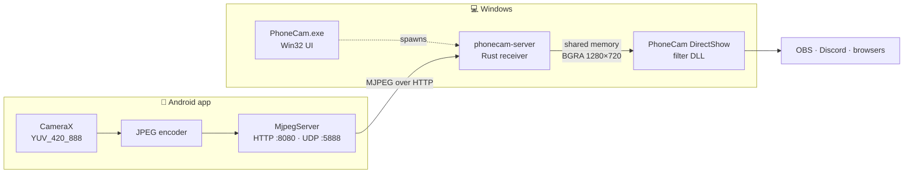

# 🧑‍💻 PhoneCam 1.1 — Development Guide

[← Back to README](README.md)

## Architecture



| Component | Stack | Responsibilities |
|:--|:--|:--|
| `android/` | Kotlin, CameraX | `CameraSource` receives YUV_420_888. `YuvPlanes` reads all three planes honoring buffer position, `rowStride` and `pixelStride`; `YuvImage` encodes JPEG. NV21 and JPEG work buffers are reused. |
| `MjpegServer` | Kotlin, sockets | HTTP on TCP 8080, UDP discovery on 5888, at most four sockets, a one-frame queue per client; a watchdog closes a blocked write after two seconds. The code changes on every service start. Every MJPEG part carries a rotation header. |
| `server/` | Rust, `std` sockets, zune-jpeg | The network thread continuously writes into a latest-frame slot; the decoder never builds a backlog. Rotation / letterbox into BGRA 1280×720, with a fast `memcpy` path for same-size unrotated frames. Limits on headers, JPEG size and image dimensions; timeouts and reconnect. |
| `vcam/` | C++, DirectShow | RGB32, 64-bit, 1280×720 / 1920×1080 / 640×480, 30 fps. Double buffer, strict seqlock validation, 2.5 s heartbeat. COM objects hold the DLL; the pin holds the filter, the back-reference to the graph is weak. Format memory is freed according to COM ownership rules. |
| `desktop/` | C++, Win32 | The EXE embeds the receiver and DLL as resources, unpacks them into a hash-named folder, registers under HKCU, and provides the window, phone discovery, code entry, test signal, preview and tray. A Job Object kills the child receiver on exit even if the window crashes. No runtimes beyond Windows itself. |

## Contracts

### Shared memory

| Field | Value |
|:--|:--|
| Name | `Local\PhoneCam_Frame_v1` |
| Size | 16 588 864 bytes — 64-byte header + two buffers of 1920×1080×4 |
| `frameIndex` | Odd while writing; even and non-zero once published |
| `activeBuffer` | `0` or `1` |
| `reserved[0]` | Low 32 bits of `GetTickCount` at publish time |
| Published image size | Fixed at 1280×720 |

The reader checks that the counter is equal before and after the copy and never returns a stale frame. Older producers without a heartbeat are incompatible with the new filter's freshness check.

A single writer is enforced by a separate named mutex, `Local\PhoneCam_Writer_v1`. An existing memory mapping does **not** by itself mean that a writer is present: readers may keep it alive after the receiver exits.

### HTTP & discovery

| Endpoint | Description |
|:--|:--|
| `GET /stream?code=123456` | `multipart/x-mixed-replace`, boundary `phonecamframe`; each part has `Content-Length` and `X-PhoneCam-Rotation: 0\|90\|180\|270` |
| `GET /` | Browser viewer |
| `GET /rotation` | Current orientation for the browser viewer |
| UDP `:5888` | `PHONECAM_DISCOVER_V1` → `PHONECAM_V1:8080` — no code, no personal data |

All HTTP endpoints require the code. The code provides **no** cryptographic protection.

## Building

### Toolchain used for this build

- Windows x64
- Visual Studio Build Tools with C++
- Rust (MSVC)
- JDK 25, Gradle wrapper 9.1.0 (JDK 17 for Kotlin is provisioned by the Gradle toolchain)
- Android SDK platform 36 / build-tools 36.0.0

Versions are pinned; bulk dependency upgrades were intentionally not done.

### Build everything

```powershell
pwsh -File .\build.ps1 -Test
```

Builds the EXE and the signed APK and runs the Rust / JVM / native checks. Output: `dist\PhoneCam-1.1.exe` and `dist\PhoneCam.apk`.

### Machine-specific setup

- `android\local.properties` holds this machine's SDK path. On another machine, set your own `sdk.dir`.
- If there is no signing key yet, run `New-ReleaseKey.ps1` **once**. Never run it to replace an existing key.

> [!IMPORTANT]
> **Signing key:** `android\phonecam-release.jks` with its password in `android\signing.properties`. Both are excluded from Git and public archives. Back them up somewhere safe — without them you cannot sign a compatible update for already-installed APKs. If the key is lost, users must uninstall the app before installing a build with a new signature.

### Receiver & installer CLI

```powershell
.\server\target\release\phonecam-server.exe --test
.\server\target\release\phonecam-server.exe --url 'http://192.168.1.42:8080/stream?code=123456'
.\dist\PhoneCam-1.1.exe --install
.\dist\PhoneCam-1.1.exe --uninstall
```

> [!WARNING]
> Do not run several receivers in the same user session. The Windows client restarts its own receiver.

## Testing

| Command | What it covers |
|:--|:--|
| `cargo test --manifest-path server\Cargo.toml` | 6 tests: URL parsing, multipart, limits, rotation, letterbox, corrupted JPEG |
| `cargo clippy --manifest-path server\Cargo.toml --all-targets -- -D warnings` | Static analysis |
| `tests\native.bat` | 1000 cycles of COM reference checks: pin/filter/enum holding, `LockServer`, `DllCanUnloadNow`, `GetStreamCaps` with an uninitialized out-pointer, size and format checks |
| `android\gradlew.bat -p android testDebugUnitTest lintRelease` | 6 JVM tests for YUV and real HTTP/UDP sockets (does not emulate physical CameraX) |
| `python tests\integration.py` | Real DirectShow frames, orientations, scaling, restart and fault recovery. Requires Python + Pillow + ffmpeg on `PATH`, the release Rust build and the current DLL registered. No physical camera is used. |
| `python tests\soak.py` | 90 s in one DirectShow graph with a receiver restart and a network drop, without recreating the capture; checks frame integrity |

Test images, logs and scratch scripts live in `work/` and are not tracked by Git. Python is only needed for developer integration tests and is not used by the product.

## Next meaningful step

1. **Measure on a real phone first:** fps, latency, temperature and battery drain.
2. If JPEG becomes the bottleneck — a separate hardware H.264 transport via MediaCodec → Media Foundation, with a bounded queue and an explicit decoder reset on connection loss.
3. For wider compatibility, consider a Media Foundation virtual camera and a 32-bit DirectShow filter as separate, testable tasks.

Don't substitute measurements with "zero latency" claims.
