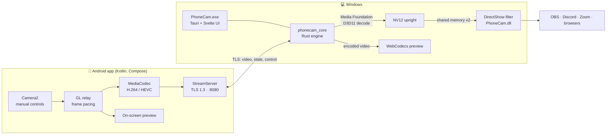

# 🧑‍💻 PhoneCam 2.0: Development Guide

[← Back to README](README.md)

## Architecture



| Directory | Stack | What it does |
|:--|:--|:--|
| `android/` | Kotlin, Camera2, MediaCodec, Jetpack Compose | Camera with manual controls, GPU relay, hardware encoder, TLS server, pairing, thermal protection, UI |
| `server/` | Rust (`phonecam_core` library + `phonecam-server` CLI) | Discovery, TLS client, Media Foundation decoding on the GPU, NV12 rotation, shared memory writer |
| `vcam/` | C++, DirectShow | Virtual camera filter: NV12/RGB32 up to 4K, event-driven delivery, phone-clock timestamps |
| `desktop/` | Tauri 2, Svelte 5, TypeScript | Desktop app: embeds the engine and the camera DLL, live preview, controls, pairing, tray |
| `tests/` | Python, C++ | Protocol probe, native filter tests, OBS-style device enumeration |

### Phone pipeline

- **Camera2** with a single output: a `SurfaceTexture` owned by `GlRelay`. ISO, shutter, EV, AWB presets, focus distance, zoom ratio, OIS/EIS and torch map directly to capture request keys.
- **60 fps** comes from a constrained high-speed session at 120 fps. `GlRelay` keeps every second frame (it drops frames closer than ¾ of the target interval), because some encoders ignore `KEY_MAX_FPS_TO_ENCODER`.
- `GlRelay` draws each kept frame to the **MediaCodec input surface** (sensor orientation, `eglPresentationTimeANDROID` = sensor timestamp) and to the **preview** (upright, using the framework's transform). The capture session never has to be rebuilt when the preview appears or disappears.
- The rotation sent to the PC comes from the framework's `SurfaceTexture` transform (see `Orientation.baseRotation`) plus the device angle with Camera2's `JPEG_ORIENTATION` sign convention.
- **Thermal**: `PowerManager.addThermalStatusListener`. At `SEVERE` or above, 60 fps / 4K step down to 1080p30. Camera loss (HAL error, another app) triggers automatic reopening with backoff.

### Wire protocol (v2)

TLS 1.3, certificates on both sides. After the handshake:

1. PC → `CLIENT_HELLO {"name"}`
2. Phone → preamble `PCAM`, u16 version = 2, u16 reserved
3. Unknown PC: phone → `PAIRING {"code"}`, waits for the user, then `PAIR_RESULT {"ok"}`
4. Phone → `HELLO` (device, lenses and capabilities, state), then `CONFIG` and `FRAME`s

Messages are `u8 type, u32 length (LE), payload`:

| Type | Direction | Payload |
|:--|:--|:--|
| `0x01 HELLO` | phone → PC | JSON: device, Android version, lenses with modes and ranges, current state |
| `0x02 STATE` | phone → PC | JSON: settings, live ISO/shutter/focus, send rate, thermal status, error |
| `0x03 CONTROL` | PC → phone | JSON: `{"set": {…partial settings…}}` |
| `0x04 PAIRING` | phone → PC | JSON: `{"code"}` |
| `0x05 CLIENT_HELLO` | PC → phone | JSON: `{"name"}` |
| `0x06 PAIR_RESULT` | phone → PC | JSON: `{"ok"}` |
| `0x10 CONFIG` | phone → PC | u8 codec (1 H.264, 2 HEVC), u16 width, u16 height, u16 fps, codec config bytes |
| `0x11 FRAME` | phone → PC | u8 flags (1 = key), i64 pts µs, u16 rotation, Annex-B access unit |

**Congestion:** the phone keeps at most 300 ms of video queued. Beyond that it drops the queue and restarts from a key frame, so latency never builds up.

**Pairing code:** first 3 bytes of SHA-256 of `"min(fpA,fpB):max(fpA,fpB)"`, mod 10⁶, computed independently on both sides.

**Discovery:** last working address → UDP `PHONECAM_DISCOVER_V2` broadcast to `255.255.255.255` and the subnet's `.255` on port 5888 (reply `PHONECAM_V2:port:fingerprint16:model`) → TCP scan of the local /24 on port 8080. The Windows firewall often drops broadcast replies; outgoing TCP always works.

### Shared memory (v2)

`Local\PhoneCam_Frame_v2`, see `vcam/PhoneCamProtocol.h` (mirrored in `server/src/shm.rs` with compile-time layout checks). 64-byte header plus two NV12 buffers of 3840×2160. Seqlock counter (`frameIndex`, odd while writing), `heartbeat` tick, source `fps` and the phone's `ptsUs`. The filter polls with a 1 ms high-resolution timer, delivers each new frame immediately, and maps phone timestamps onto stream time, rebasing on large drift.

### Virtual camera registration

Per user (HKCU) on every start of the desktop app, from `%LOCALAPPDATA%\PhoneCam\camera-<hash>`. Elevated processes ignore HKCU, so the app offers `--register-system` (one UAC prompt), which copies the DLL to `%ProgramData%` and writes HKLM.

## Building

Requirements: Windows x64, Visual Studio Build Tools (C++), Rust (MSVC), Node.js 20+, JDK 17+ (Gradle provisions 17), Android SDK 36.

```powershell
pwsh -File .\build.ps1 -Test
```

This builds `vcam\out\PhoneCam.dll`, then the desktop app (which embeds the DLL), then the release APK. Output: `dist\PhoneCam.exe` and `dist\PhoneCam.apk`.

Individual parts:

```powershell
vcam\build.bat                                  # virtual camera DLL
cd desktop; npm ci; npx tauri build --no-bundle # desktop app
android\gradlew.bat -p android assembleRelease  # APK
cargo build --release --manifest-path server\Cargo.toml   # CLI receiver
```

> [!IMPORTANT]
> **Signing key:** `android\phonecam-release.jks` with its password in `android\signing.properties`, excluded from Git. Back both up: without them you cannot ship an update that installs over existing copies. Create one with `New-ReleaseKey.ps1` if none exists. Debug builds are signed with the same key so they install over a release.

## Testing

| Command | Covers |
|:--|:--|
| `cargo test --release --manifest-path server\Cargo.toml` | Protocol parsing, address parsing, NV12 rotation (incl. 1080p round trip), parameter-set detection, pairing code |
| `android\gradlew.bat -p android testDebugUnitTest` | Rotation from the camera transform and device angle |
| `tests\native.bat` | 1000 COM lifetime cycles, format validation, NV12 scaling/letterbox and NV12→RGB conversion |
| `python tests\probe.py HOST 10 out.h264 --set '{"fps":60}'` | Live stream against a paired phone: frame pacing, arrival jitter, bitrate |
| `tests\enum_like_obs.cpp` | Enumerates capture devices the way OBS does |
| `phonecam-server.exe --connect HOST` | Receiver without UI; prints JSON events, forwards JSON lines from stdin as control |

Useful environment variables: `PHONECAM_LOG=path` (desktop app event log), `PHONECAM_SOFTWARE_DECODE=1` (disable GPU decoding), `PHONECAM_PROFILE=1` (per-frame timings in the CLI).
