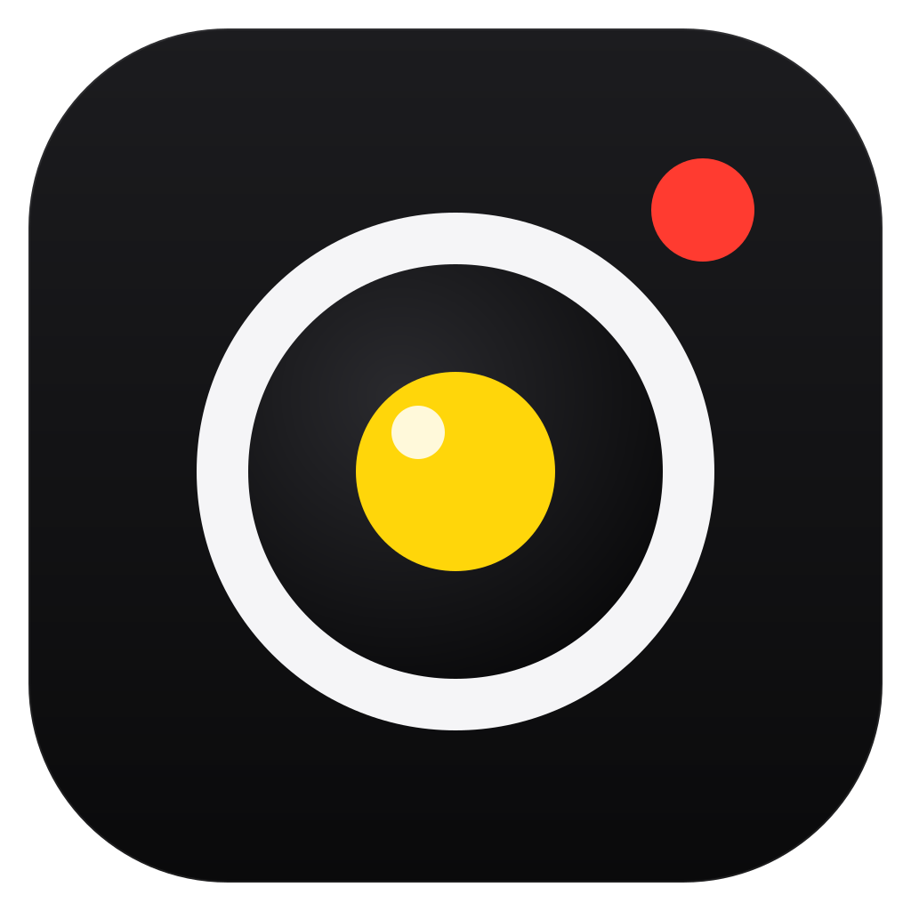

# PhoneCam

**Turn your Android phone into a high-quality Windows webcam.**

A **100% free, open-source alternative to DroidCam**.
1080p60 and 4K, full manual camera control, encrypted, no codes to type. No ads, no "Pro" upgrade, no watermark, no account.

[Why PhoneCam](#-why-phonecam) · [Quick start](#-quick-start) · [Camera controls](#-camera-controls) · [OBS](#-using-it-in-obs) · [Troubleshooting](#-troubleshooting) · [Development](DEVELOPMENT.md)

---

## 💚 Why PhoneCam

Most phone-as-webcam apps are "free" until you want what matters: HD video, no watermark, no ads. PhoneCam gives you **everything, free, forever**.

| | PhoneCam |
|:--|:--:|
| 💸 Price | **Free**: no trial, no subscription, no in-app purchases |
| 📺 Quality | **Up to 4K30 and 1080p60**, hardware H.264 / HEVC |
| 🎛 Manual control | **ISO, shutter, EV, white balance, focus, zoom, stabilization, flashlight**, from the phone *or* the PC |
| 🔐 Security | **TLS 1.3 encryption**, one-time pairing, no codes to type afterwards |
| 🚫 Ads / watermark / account | **None** |
| ☁️ Cloud / telemetry | **None**: video never leaves your local network |
| 🔓 Source code | **Open source, MIT-licensed** |

## ✨ Features

- 🎥 **Virtual camera for every app**: appears as **PhoneCam** in OBS, Discord, Zoom, Teams and browsers (NV12 or RGB32, up to 4K, landscape or portrait)
- ⚡ **Smooth by design**: hardware encoding on the phone, GPU decoding on the PC (~5 ms per frame), frames delivered the moment they arrive, phone timestamps passed on so OBS can smooth Wi-Fi jitter
- 📶 **Automatic connection**: open the app on the phone and the PC finds it over Wi-Fi or USB, no addresses or codes
- 🖥 **Desktop app** with a live preview, every camera control, stream stats, and a tray icon that keeps the camera running
- 🌡 **Overheat protection**: if the phone gets hot, PhoneCam steps down to 1080p30 before the system shuts the camera off, and reopens the camera automatically if it ever is lost
- 🌙 **Screen-off mode** on the phone to save battery during long recordings

> [!NOTE]
> Video only: the microphone is not streamed.

## 🚀 Quick start

| # | Where | What to do |
|:-:|:--|:--|
| 1 | 📱 Phone | Install `PhoneCam.apk` (Android 10+) and open it. Allow camera access. It goes live right away. |
| 2 | 💻 PC | Run `PhoneCam.exe`. No installer, no drivers. |
| 3 | 📶 Network | Keep the phone and the PC on the same Wi-Fi, or plug the phone in over USB (with USB debugging on). |
| 4 | 📱 Phone | **First time only:** the phone asks *"Connect to this PC?"* and shows a six-digit code. Check that the PC shows the same code and tap **Allow**. |
| 5 | 🎬 App | Pick the **PhoneCam** camera in OBS, Discord, Zoom or your browser. |

Next time: open PhoneCam on the phone, and that's it. The PC reconnects by itself.

> [!TIP]
> Prebuilt `PhoneCam.exe` and `PhoneCam.apk` are published on the Releases page. To build them yourself, see [DEVELOPMENT.md](DEVELOPMENT.md).

## 🎛 Camera controls

Everything below is available on the phone (pro-camera style bar) and in the desktop app (side panel). Changes apply instantly on both.

| Control | Options |
|:--|:--|
| **Lens** | Every camera the phone exposes to apps (some phones keep ultra-wide lenses for their own camera app only) |
| **Quality** | 4K 30 · 1080p 60 · 1080p 30 · 720p 60 · 720p 30, depending on the phone |
| **Exposure** | Auto, or manual **ISO** and **shutter** (at 30 fps), **EV** compensation, exposure lock |
| **White balance** | Auto, Tungsten, Warm, Fluorescent, Daylight, Cloudy, Twilight, Shade, WB lock |
| **Focus** | Continuous autofocus or manual distance |
| **Zoom** | Smooth 1× to 8× |
| **Stream** | H.264 or HEVC, 4–60 Mbps, picture orientation (Auto / Upright / On its side) |
| **Image** | Optical and electronic stabilization, flashlight |

> [!IMPORTANT]
> **60 fps modes** run the sensor at 120 fps: they need good light and warm the phone. For long recordings, 1080p 30 with H.264 keeps the phone coolest. Take the phone out of its case if it gets warm.

## 🎬 Using it in OBS

1. **Sources → + → Video Capture Device → PhoneCam**.
2. Resolution/FPS type: **Custom**, resolution **1920×1080**, FPS **30** or **60** to match the phone.
3. Keep *Buffering* on **Auto** so OBS can smooth Wi-Fi jitter using the phone's timestamps.

> [!NOTE]
> If OBS runs **as administrator** (common for game capture), Windows hides per-user cameras from it. The desktop app detects this and shows a **Fix** button in the *Virtual camera* tile. It needs one administrator prompt, and then PhoneCam is visible to every app.

## 🛠 Troubleshooting

| Symptom | What to check |
|:--|:--|
| PC keeps "Looking for your phone" | PhoneCam is open on the phone; same Wi-Fi (not a guest network); no VPN. Or connect by address in the desktop app's settings. |
| Camera missing in OBS | See the *Fix* button above (OBS running as administrator), then restart OBS. |
| Picture sideways | Set picture orientation to **Auto**, or to how the phone actually stands (**Upright** / **On its side**). |
| "Phone is getting warm" | Switch to 1080p 30, remove the case, avoid charging while recording at 60 fps. |
| Stutter on Wi-Fi | Use 5 GHz Wi-Fi near the router or USB; lower the bitrate to 12–15 Mbps. |
| HEVC unavailable on the PC | Windows needs HEVC decoding support; H.264 works everywhere. |

## 🔐 Security & privacy

- The phone and PC each create their own key on first run. Phone keys stay in the Android Keystore.
- Every connection is **TLS 1.3 with certificates on both sides**. Only PCs you approved on the phone can see the camera.
- The pairing code is derived from both keys, so a device intercepting the connection would show a different code.
- No cloud, no accounts, no analytics. Video stays on your local network.

## 📂 Files & uninstall

| What | Where |
|:--|:--|
| PC identity and paired phones | `%APPDATA%\PhoneCam` |
| Virtual camera (per user) | `%LOCALAPPDATA%\PhoneCam\camera-<version>` |
| Virtual camera (for admin apps, optional) | `%ProgramData%\PhoneCam\camera-<version>` |

To remove the camera: desktop app → Settings → **Remove**, then delete the folders above. On the phone, paired PCs can be forgotten in the settings sheet.

## 📚 Documentation

| Document | Contents |
|:--|:--|
| [DEVELOPMENT.md](DEVELOPMENT.md) | Architecture, protocol, building and testing |
| [TEST_REPORT.md](TEST_REPORT.md) | What was measured on real hardware and what was not |
| [ROADMAP.md](ROADMAP.md) | What is done and what could come next |
| [THIRD_PARTY.md](THIRD_PARTY.md) | Third-party components and licenses |

## 📄 License

PhoneCam is open source under the [MIT License](LICENSE). Third-party components keep their own licenses: see [THIRD_PARTY.md](THIRD_PARTY.md).
